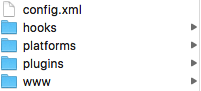

# Cordova-Source-Code-Analyse
Hybrid App Source Code Analyse

[官网](http://cordova.apache.org)

#### 文件分类

>目录文件说明：
>
conig.xml ：cordova的配置文件
>
hooks/ ：存放自定义cordova命令的脚本文件。
>
platforms/ ：各个平台原生工程代码，会在build时被覆盖勿修改
>
plugins/ ：插件目录（主要是提供各个平台的原生API）
>
www/ ：用H5编写的源代码目录，build时会被放入各个平台的assets\www目录。
>
www/index.html ：App入口html文件

#### 关键类
JS端

* cordova_plugins.js 插件配置文件
* exec.js 在cordova.js里复现，主要用于JS与Native的交互处理事件
* platform.js 在cordova.js里复现，
* cordova.js  JS端最重要的文件了。提供交互处理
* index.html 关联 index.js,index.css UI显示

Native端

* CDVPlugin 插件类，自定义插件继承于此
* CDV 头文件
* CDVAppDelegate 入口，在didFinishLaunchingWithOptions:里初始化CDVViewController
* CDVAvaliability 宏定义
* CDVAvailabilityDeprecated 弃用提示
* CDVCommandDelegate 命令代理类，JS处理
* CDVCommandDelegateImpl 代理类实现，处理JS
* CDVCommandQueue 命令队列，对应于cordova.commandQueue队列
* CDVConfigParser config文件解析（XML格式）
* CDVUIWebViewEngine WebView处理机
* CDVWebViewEngineProtocol WebView处理机代理类
* CDVWhitelist 白名单（允許訪問任何網站）结合config.xml  <access> 元素
* CDVScreenOrientaitionDelegate 屏幕方向处理
* CDVLocalStorage 本地存储
* CDVTimer 计时类
* CDVUserAgentUtil 代理工具类
* CDVURLProtocol 继承于NSURLProtocol.在 Objective-C 端使用一个 NSURLProtocol 的子类来检查每个请求
* CDVInvokedUrlCommand js交互命令类（_callbackId;_className; _methodName;_arguments;）
* CDVPluginResult 组件处理完后执行类

####生命周期
参见cordova.js 595-610行。

cordova的初始化包含JS端和Native端，这两端都是基于事件侦听的方式结合起来，JS端主要包含以下几个点：

onDOMContentLoaded：dom载入完成

onNativeReady：Native端WebUI载入完成

onCordovaReady：JS端相关objects都创建完成

onDeviceReady: Cordova 准备

onResume: 开始/恢复生命周期事件
                 
onPause: 暂停生命周期 

**Cordova生命周期事件：**

（1）deviceready ：当Cordova加载完成会触发

（2）pause：当应用程序进入到后台会触发

（3）resumes：应用程序从后台进入到前台会触发

    
 
以上几个重要事件的先后顺序和hander侦听是通过channel组件架构，所谓的channel组件实际上就是cordova自制的保障事件侦听和触发的组件,具体代码参考cordova.js 626-820行。2百多行代码，就打造了一个JS端事件侦听的框架。

其中 onNativeReady是被native端调的，当native端WebUI初始化好后就会fire JS端onNativeReady事件，native有以下几个关键的初始化节点：

    AppDelegate.didFinishLaunchingWithOptions：App启动，初始化controller和view
    CDVViewController.viewDidLoad：view加载，初始化WebView
    CDVViewController.webviewDidFinishLoad：WebView加载，触发JS端onNativeReady
Native端存在着App->view->webview三个层次，以上三个点正好对应着这三个层次的加载。

####加载流程
从源码可以看出AppDelegate继承于CDVAppDelegate;MainViewController继承于CDVViewController。MainCommandDelegate继承于CDVCommandDelegateImpl,MainCommandQueue继承于CDVCommandQueue.

AppDelegate是程序的入口，由此调用MainViewController,由此启动CDVViewController.

1. AppDelegate的application:didFinishLaunchingWithOptions:进入
2. 从self.viewController = [[MainViewController alloc] init]；到MainViewController.
3. CDVViewController 进入init方法
4. initWithNibName: bundle:方法调用[self __init]
5. __init方法监听通知，UIApplicationWillTerminateNotification（程序被杀死），UIApplicationWillResignActiveNotification（从活动状态进入非活动状态），UIApplicationDidBecomeActiveNotification（程序进入前台并处于活动状态），UIApplicationWillEnterForegroundNotification（进入前台，还没有处于活动状态时），UIApplicationDidEnterBackgroundNotification（进入后台）。在应用处于各种状态时就可以通过evalJs：方法与JS端交互。最终是通过CDVUIWebViewEngine下的evaluateJavaScript: completionHandler:的方法。最终还是用的UIWebView的stringByEvaluatingJavaScriptFromString:方法。从此可以看出，Native处理JS原理上还是用的UIWebView的方法。CDVViewController初始化完成。
6. 此时AppDelegate调用Super,进入CDVAppDelegate的application: didFinishLaunchingWithOptions:方法。对rootViewController，主window进行设置。此时App才加载MainViewController.走MainViewController生命周期。
7. 在MainViewController里其实是调用CDVViewController的。进入viewDidLoad方法，在loadSettings里加载配置文件并将index.html设为startPage。
8. createGapVeiw初始化webView,通过CDVWebViewEngineProtocol使用CDVUIWebViewEngine使用engineWebView（这是个UIWebView）处理JS。
9. registerPlugin: withClassName:初始化插件，此处的插件是CDVUIWebViewEngine。
10. 将handleopenurl,intentandnavigationfilter,gesturehandler插件注入。计时结束。
11. CDVUserAgentUtil acquireLock:加锁处理，加载index.html
12. 当App进入活跃状态，接收到通知进入onAppDidBecomeActive:方法，执行JS的active事件。js为
    
   
    <code>try{cordova.require('cordova/exec').nativeEvalAndFetch(function(){cordova.fireDocumentEvent('active');})}catch(e){console.log('exception nativeEvalAndFetch : '+e);};</code>

   如此就和cordova.js发生了联系。
13. 此后WebView开始加载，并触发了CDVUIWebViewDelegate的webView: shouldStartLoadWithRequest: navigationType:方法。如果_delegate实现了webView:shouldStartLoadWithRequest:navigationType:此时会进入CDVUIWebViewNavigationDelegate。在此判断url的scheme是否为gap(处理加载页里的加载请求)。
14. CDVIntentAndNavigationFilter实现了shouldOverrideLoadWithRequest:navigationType:方法，根据navigationType返回是否请求加载。
15. 允许加载后，走CDVUIWebViewDelegate的webViewDidStartLoad:方法。跳到CDVUIWebViewNavigationDelegate的webViewDidStartLoad:向enginePlugin.webView发送CDVPluginResetNotification通知。但是CDVUIWebViewEngine没有对onReset处理。其他插件根据需要处理。
16. 然后走CDVUiWebViewDelegate的webViewDidFinishLoad:方法。跳转CDVUIWebViewNavigationDelegate的webViewDidFinishLoad：方法。发送CDVPageDidLoadNotification通知。此版本未处理。
17. iframe bridge 在 JS 端创建一个透明的 iframe，设置这个 ifame 的 src 为自定义的协议，而 ifame 的 src 更改时，UIWebView 会先回调其 delegate 的 webView:shouldStartLoadWithRequest:navigationType: 方法。此时又到了CDVUIWebViewDelegate的shouldStartLoadWithRequest：方法。此时的请求是gap://ready。
18. CDVViewController的supportedInterfaceOrientations监听App的屏幕显示，是否左转右转等。
19. 到此，页面加载完毕。

####JS调用Native

IOS的UIWebViewDelegate提供了shouldStartLoadWithRequest方法，它能截获web端url请求，因此phonegap就是通过在web端构造一个不可见的iframe，并置其src为gap://ready，Native端截获这个请求后就会得知此时JS端有请求。这块代码可见"cordova/exec"模块：

    function pokeNative() {
    // CB-5488 - Don't attempt to create iframe before document.body is available.
    if (!document.body) {
        setTimeout(pokeNative);
        return;
    }
    
    // Check if they've removed it from the DOM, and put it back if so.
    if (execIframe && execIframe.contentWindow) {
        execIframe.contentWindow.location = 'gap://ready';
    } else {
        execIframe = document.createElement('iframe');
        execIframe.style.display = 'none';
        execIframe.src = 'gap://ready';
        document.body.appendChild(execIframe);
    }
    // Use a timer to protect against iframe being unloaded during the poke (CB-7735).
    // This makes the bridge ~ 7% slower, but works around the poke getting lost
    // when the iframe is removed from the DOM.
    // An onunload listener could be used in the case where the iframe has just been
    // created, but since unload events fire only once, it doesn't work in the normal
    // case of iframe reuse (where unload will have already fired due to the attempted
    // navigation of the page).
    failSafeTimerId = setTimeout(function() {
        if (commandQueue.length) {
            // CB-10106 - flush the queue on bridge change
            if (!handleBridgeChange()) {
                pokeNative();
             }
        }
    }, 50); // Making this > 0 improves performance (marginally) in the normal case (where it doesn't fire).
    }
每次在js端调用exec时，cordova会把调用信息放入commandQueue队列中，并通知native端。native端得到通知后，会调用js端的代码拿到commandQueue队列中所有调用信息，并依次调用plugin来执行请求

    function iOSExec() {

    var successCallback, failCallback, service, action, actionArgs;
    var callbackId = null;
    if (typeof arguments[0] !== 'string') {
        // FORMAT ONE
        successCallback = arguments[0];
        failCallback = arguments[1];
        service = arguments[2];
        action = arguments[3];
        actionArgs = arguments[4];

        // Since we need to maintain backwards compatibility, we have to pass
        // an invalid callbackId even if no callback was provided since plugins
        // will be expecting it. The Cordova.exec() implementation allocates
        // an invalid callbackId and passes it even if no callbacks were given.
        callbackId = 'INVALID';
    } else {
        throw new Error('The old format of this exec call has been removed (deprecated since 2.1). Change to: ' +
            'cordova.exec(null, null, \'Service\', \'action\', [ arg1, arg2 ]);'
        );
    }

    // If actionArgs is not provided, default to an empty array
    actionArgs = actionArgs || [];

    // Register the callbacks and add the callbackId to the positional
    // arguments if given.
    if (successCallback || failCallback) {
        callbackId = service + cordova.callbackId++;
        cordova.callbacks[callbackId] =
            {success:successCallback, fail:failCallback};
    }

    actionArgs = massageArgsJsToNative(actionArgs);

    var command = [callbackId, service, action, actionArgs];

    // Stringify and queue the command. We stringify to command now to
    // effectively clone the command arguments in case they are mutated before
    // the command is executed.
    commandQueue.push(JSON.stringify(command));

    // If we're in the context of a stringByEvaluatingJavaScriptFromString call,
    // then the queue will be flushed when it returns; no need for a poke.
    // Also, if there is already a command in the queue, then we've already
    // poked the native side, so there is no reason to do so again.
    if (!isInContextOfEvalJs && commandQueue.length == 1) {
        pokeNative();
    }
    }
Native端：shouldStartLoadWithRequest

    if ([[url scheme] isEqualToString:@"gap"]) {
        [vc.commandQueue fetchCommandsFromJs];
        // The delegate is called asynchronously in this case, so we don't have to use
        // flushCommandQueueWithDelayedJs (setTimeout(0)) as we do with hash changes.
        [vc.commandQueue executePending];
        return NO;
    }
***
     // 获取 JS 的请求数据
    - (void)fetchCommandsFromJs
    {
    __weak CDVCommandQueue* weakSelf = self;
    NSString* js = @"cordova.require('cordova/exec').nativeFetchMessages()";

    [_viewController.webViewEngine evaluateJavaScript:js
                                    completionHandler:^(id obj, NSError* error) {
        if ((error == nil) && [obj isKindOfClass:[NSString class]]) {
            NSString* queuedCommandsJSON = (NSString*)obj;
            CDV_EXEC_LOG(@"Exec: Flushed JS->native queue (hadCommands=%d).", [queuedCommandsJSON length] > 0);
            [weakSelf enqueueCommandBatch:queuedCommandsJSON];
            // this has to be called here now, because fetchCommandsFromJs is now async (previously: synchronous)
            [self executePending];
        }
    }];
    }

    - (void)executePending
    {
    // Make us re-entrant-safe.
    if (_startExecutionTime > 0) {
        return;
    }
    @try {
        _startExecutionTime = [NSDate timeIntervalSinceReferenceDate];

        while ([_queue count] > 0) {
            NSMutableArray* commandBatchHolder = _queue[0];
            NSMutableArray* commandBatch = nil;
            @synchronized(commandBatchHolder) {
                // If the next-up command is still being decoded, wait for it.
                if ([commandBatchHolder count] == 0) {
                    break;
                }
                commandBatch = commandBatchHolder[0];
            }

            while ([commandBatch count] > 0) {
                @autoreleasepool {
                    // Execute the commands one-at-a-time.
                    NSArray* jsonEntry = [commandBatch cdv_dequeue];
                    if ([commandBatch count] == 0) {
                        [_queue removeObjectAtIndex:0];
                    }
                    CDVInvokedUrlCommand* command = [CDVInvokedUrlCommand commandFromJson:jsonEntry];
                    CDV_EXEC_LOG(@"Exec(%@): Calling %@.%@", command.callbackId, command.className, command.methodName);

                    if (![self execute:command]) {
    #ifdef DEBUG
                            NSString* commandJson = [jsonEntry cdv_JSONString];
                            static NSUInteger maxLogLength = 1024;
                            NSString* commandString = ([commandJson length] > maxLogLength) ?
                                [NSString stringWithFormat : @"%@[...]", [commandJson substringToIndex:maxLogLength]] :
                                commandJson;

                            DLog(@"FAILED pluginJSON = %@", commandString);
    #endif
                    }
                }

                // Yield if we're taking too long.
                if (([_queue count] > 0) && ([NSDate timeIntervalSinceReferenceDate] - _startExecutionTime > MAX_EXECUTION_TIME)) {
                    [self performSelector:@selector(executePending) withObject:nil afterDelay:0];
                    return;
                }
            }
        }
    } @finally
    {
        _startExecutionTime = 0;
    }
    }
在CDVCommandQueue里的execute:方法里用objc_msgSend执行JS里需要的方法。
####Native向JS返回结果
使用webView的 stringByEvaluatingJavaScriptFromString 方法 。native的plugin完成任务后，会在CDVPluginResult里执行initWithStatus:(CDVCommandStatus)statusOrdinal message:(id)theMessage；在CDVCommandDelegateImpl里执行sendPluginResult:(CDVPluginResult*)result callbackId:(NSString*)callbackId；返回结果给JS端。
通过上面，我们知道JS和Native是通过callbackId对应的，由此就建立了连接。

    // Objective-C 返回结果给JS端
    - (void)sendPluginResult:(CDVPluginResult*)result callbackId:(NSString*)callbackId
    {
    CDV_EXEC_LOG(@"Exec(%@): Sending result. Status=%@", callbackId, result.status);
    // This occurs when there is are no win/fail callbacks for the call.
    if ([@"INVALID" isEqualToString:callbackId]) {
        return;
    }
    // This occurs when the callback id is malformed.
    if (![self isValidCallbackId:callbackId]) {
        NSLog(@"Invalid callback id received by sendPluginResult");
        return;
    }
    int status = [result.status intValue];
    BOOL keepCallback = [result.keepCallback boolValue];
    NSString* argumentsAsJSON = [result argumentsAsJSON];
    BOOL debug = NO;
    
    #ifdef DEBUG
    debug = YES;
    #endif
     // 将请求的处理结果及 callbackId 通过调用 JS 方法返回给 JS 端
    NSString* js = [NSString stringWithFormat:@"cordova.require('cordova/exec').nativeCallback('%@',%d,%@,%d, %d)", callbackId, status, argumentsAsJSON, keepCallback, debug];

    [self evalJsHelper:js];
    }
####自定义组件
此处我们默认已经解决了插件的下载和制作。所要做的就是处理插件。

将CordovaLib引入项目。

在配置页的 Build Settings -> Other Linker Flags 中添加"-ObjC -all_load"

在配置页的 Build Phases 标签中添加如下两个库：

    Target Dependencies -> CordovaLib

    Link Binary With Libraries -> libCordova.a
[测试](http://www.hangge.com/blog_uploads/201604/2016042214355230378.zip)

最主要关注的是Hybrid里的跳转逻辑，用scheme跳转解决。在CDVUIWebViewNagigationDelegate 里的shouldStartLoadWithRequest：里实现自己的跳转逻辑即可，因为在cordova里触发跳转，肯定会走这里的。如果实现了CDVWKWebViewEngine,在webView: webView: decidePolicyForNavigationAction: decisionHandler: 里也要实现.

其他的都是套路。