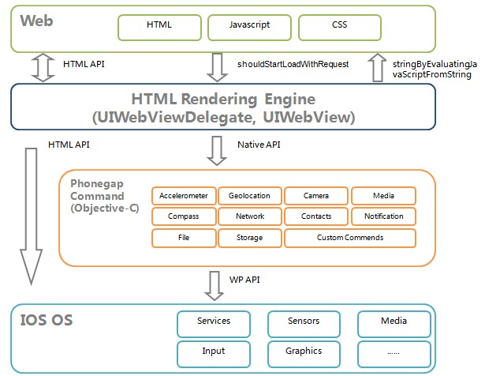

# Cordova-Source-Code-Analyse
Hybrid App Source Code Analyse

* CDVPlugin 插件类，自定义插件继承于此
* CDV 头文件
* CDVAppDelegate 入口，在didFinishLaunchingWithOptions:里初始化CDVViewController
* CDVAvaliability 宏定义
* CDVAvailabilityDeprecated 弃用提示
* CDVCommandDelegate 命令代理类，JS处理
* CDVCommandDelegateImpl 原生处理JS
* CDVCommandQueue 对应于cordova.commandQueue队列中所有调用信息

####生命周期
参见cordova.js 595-610行。

cordova的初始化包含JS端和Native端，这两端都是基于事件侦听的方式结合起来，JS端主要包含以下几个点：

onDOMContentLoaded：dom载入完成

onNativeReady：Native端WebUI载入完成

onCordovaReady：JS端相关objects都创建完成

onDeviceReady: Cordova 准备

onResume: 开始/恢复生命周期事件
                 
onPause: 暂停生命周期 

**Cordova生命周期事件：**

（1）deviceready ：当Cordova加载完成会触发

（2）pause：当应用程序进入到后台会触发

（3）resumes：应用程序从后台进入到前台会触发

    
 
以上几个重要事件的先后顺序和hander侦听是通过channel组件架构，所谓的channel组件实际上就是cordova自制的保障事件侦听和触发的组件,具体代码参考cordova.js 626-820行。2百多行代码，就打造了一个JS端事件侦听的框架。

其中 onNativeReady是被native端调的，当native端WebUI初始化好后就会fire JS端onNativeReady事件，native有以下几个关键的初始化节点：

    AppDelegate.didFinishLaunchingWithOptions：App启动，初始化controller和view
    CDVViewController.viewDidLoad：view加载，初始化WebView
    CDVViewController.webviewDidFinishLoad：WebView加载，触发JS端onNativeReady
Native端存在着App->view->webview三个层次，以上三个点正好对应着这三个层次的加载。

